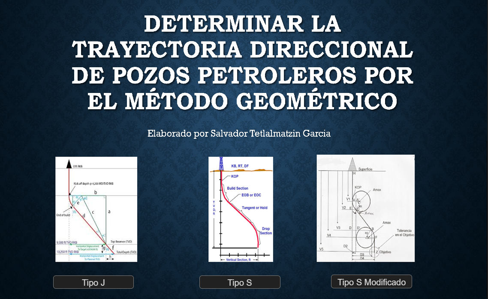
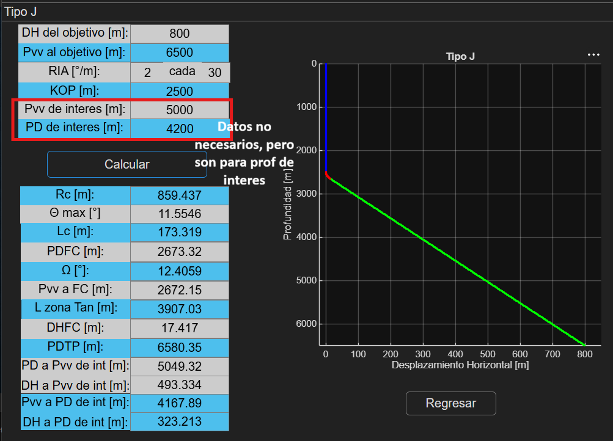
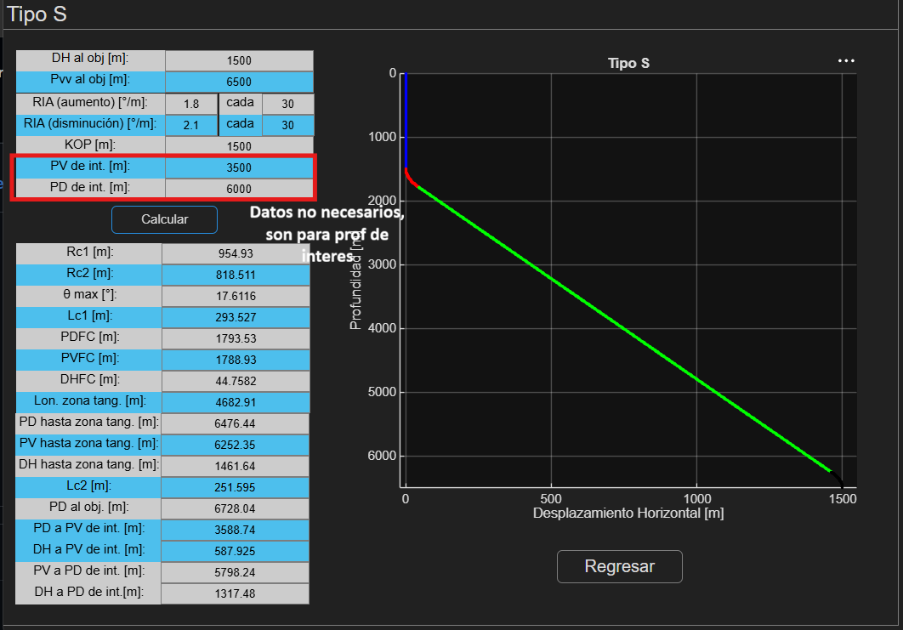
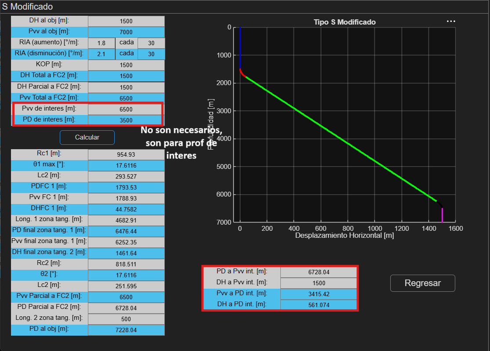

# Trayectoria Direccional de Pozos Petroleros por el Metodo Geometrico

Buen dia a todos, este programa sirve para calcular por el metodo geometrico, la trayectoria direccional de pozos petroleros, ya sea tipo J, S o S modificado.

## Consideraciones

Los calculos se dividen principalmente en la seccion vertical, construccion del angulo, seccion tangencial, seccion para tumbar angulo (en tipo S y S modificado) y segunda seccion vertical.

En general, el procedimiento para calcular los diferentes tipos de trayectoria se encuentran en internet, pero para el caso del Tipo S Modificado fue mas complicado de encontrar, por lo que lo obtuve aplicando mis conocimientos de geoemtria, por lo que si existen errores y no les da el mismo resultado, comentarlo por favor.

Ademas, este programa cuenta con la funcion de calcular puntos de interes, ya sea con la profundidad vertical o desarrollada.

## Instalacion

Para ejecutar los programas, use el lenguaje de programacion MatLab version R2026A, por lo que se recomienda tenerla instalada.
Hay dos opciones para ejecutar el programa:

1.- Los archivos que tengan la extension '.mlapp' son donde se encuentran las lineas de codigo del programa y se necesitara tener instalado la aplicacion de MatLab. No es necesario descargar todos los archivos para que funcione, si se necesita solo la parte del metodo tipo J, solo necesitas descargar el archivo 'tipo__j_App.mlapp', y asi con los otros. En el caso de la portada, es el menu principal de la aplicacion, y solo se necesita el archivo 'porta.PNG' para que tenga fondo, pero aun asi puede funcionar.

2.- Sino quieres descargar las lineas de codigo del programa, puedes descargar solo el archivo ejecutable 'trayectoria_direccional.exe', el cual no es necesario instalar completamente la app de MatLab, pero si necesitas una herramienta para correr el programa, como lo es 'MATLAB Runtime'.

## Screenshots

